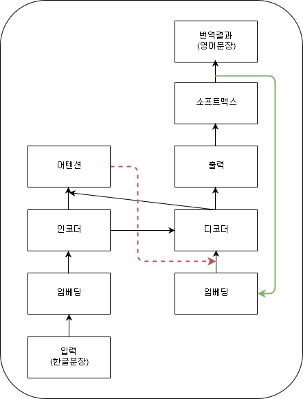
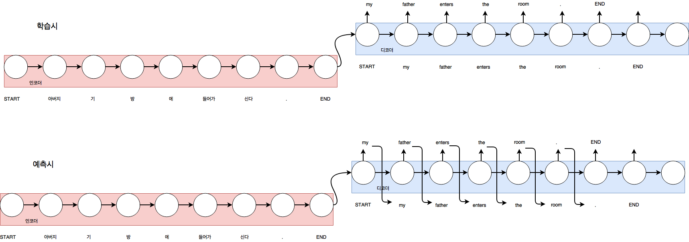
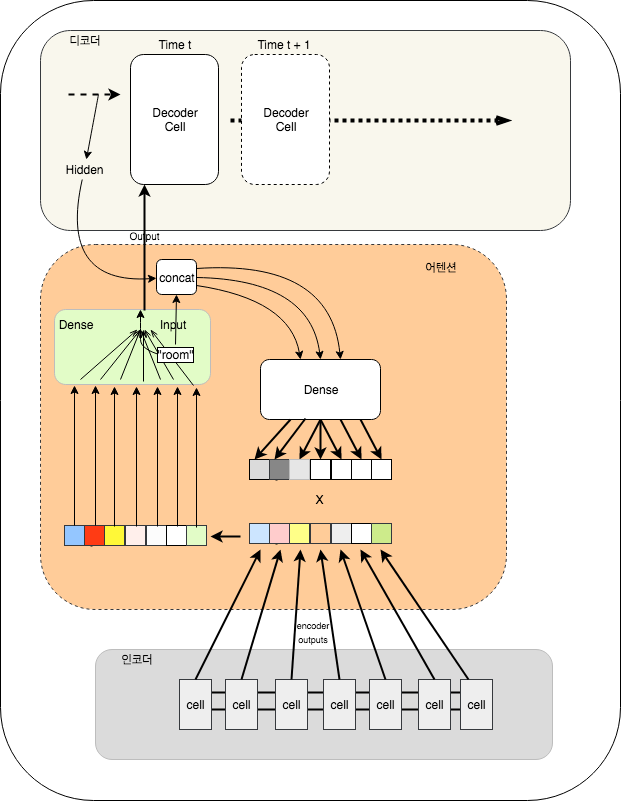
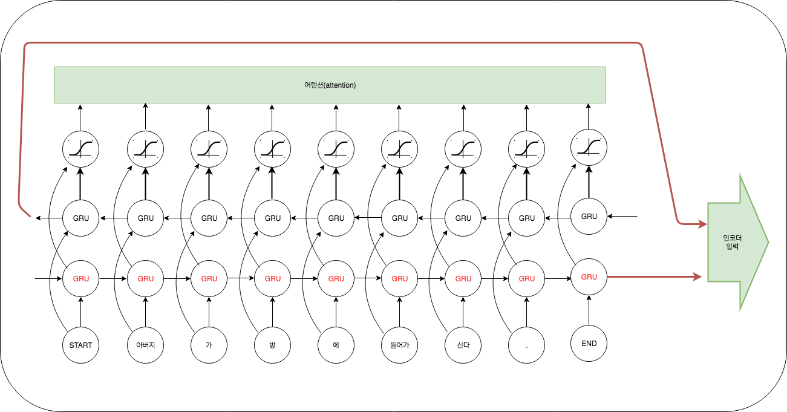
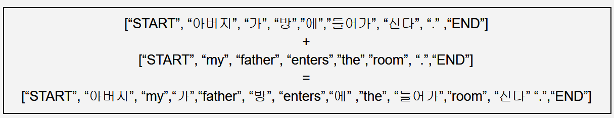

### Neural Korean to English Machine Translater with Gluon  

2018 마이크로소프트웨어 기사를 통해 오신분은 [이곳](maso_ver/)을 참고하세요. 


####  특징  

- Seq2Seq with Attention 
- Gluon 기반 [Hybridize](https://mxnet.incubator.apache.org/tutorials/gluon/hybrid.html)
- 공개 학습셋 (from https://github.com/jungyeul/korean-parallel-corpora) 기반 학습 
- multi gpu 학습 옵션 제공 
- Variable Sentence Length 학습  


#### 요구사항 

- Python 3.5 이상 
- MXNet 1.0 이상 
- tqdm, konlpy, stemming, gensim

#### 구성

- 아키텍처 



- seq2seq



- Attention 



- bi-directional GRU encoder 



- 영한 교차 임베딩 학습 




#### TODO 

- Beam Search 구현


#### How to 

- 임베딩 학습

```
python main.py --embedding 
```

- 번역 모형 학습 

```
CUDA_VISIBLE_DEVICES='4,5,6,7' python main.py --train --gpu-count 4 --batch-size 100
```

- 번역 모형 테스트 


```
python main.py --test --init-model "models/trained_model.params" 

kor > 오바마는 대통령이다.
오바마는 대통령이다.
eng > obama is a presid .
kor > 좋은 아침.
좋은 아침.
eng > good morn
kor > 북한은 핵무기를 가지고 있다.
북한은 핵무기를 가지고 있다.
eng > north korea has a nuclear weapon .
kor >
```

- models/trained_model.params
  1. rmsprop(batch size : 100, lr : 0.01) : 7 epocs 
  1. sgd (batch size : 100, lr : 0.01) : 33 epocs


